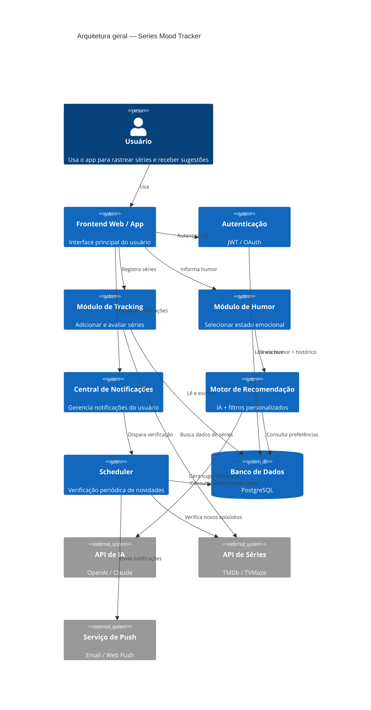

# Tracker-de-Séries

## Sobre o Projeto
**Projeto:** [Tracker de Séries]
**Problema que resolve:** [Notificar novos episódios e lançamentos]

## Integrantes
| Nome | GitHub |
|------|--------|
| Arthur Lopes Laranjeira | @LaranjeiraArthur31 |
| Igor Mastrangelo Domingos | @IgorMastrangelo |
| Vitor Martins Furlan | @vtr1812 |

